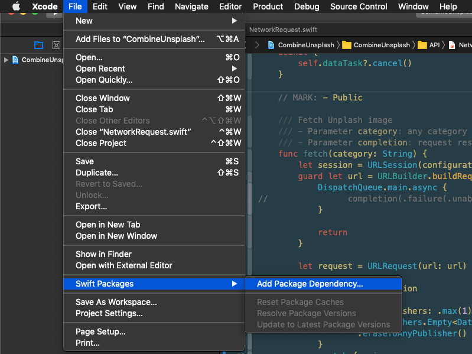
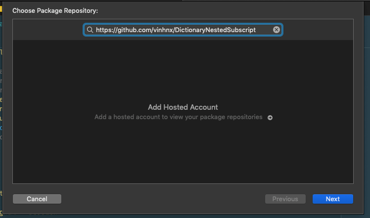
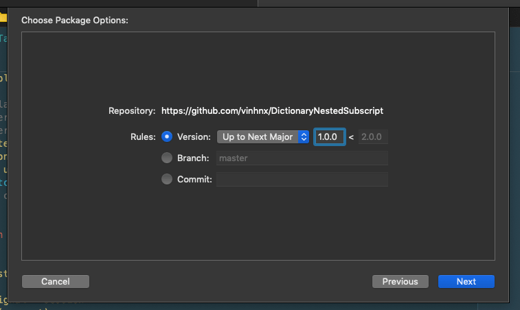
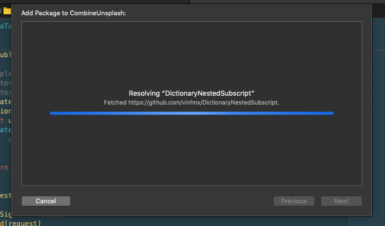
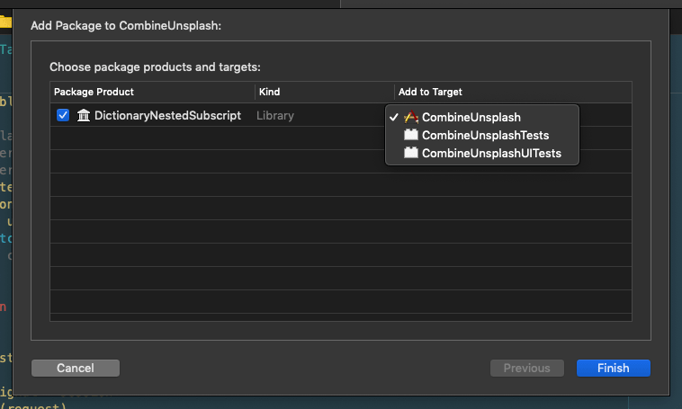
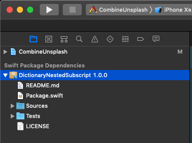

# DictionaryNestedSubscript

A Swift Package that enable nested `subscript` on `Dictionary`.

I will publish this package to GitHub Package Registry when it comes out from beta.

> https://github.blog/2019-06-03-github-package-registry-will-support-swift-packages/

### Usage

```swift
let dictionary: [String: Any] = [
    "countries": [
        "japan": [
            "capital": [
                "name": "tokyo",
                "lat": "35.6895",
                "lon": "139.6917"
            ],
            "language": "japanese"
        ]
    ]
]

dictionary[jsonDict: "countries"]?[jsonDict: "japan"]?[jsonDict: "capital"]?["name"] // "tokyo"
```

### Integration (requires Xcode 11+)













Profit (?!) :rocket::smile:
